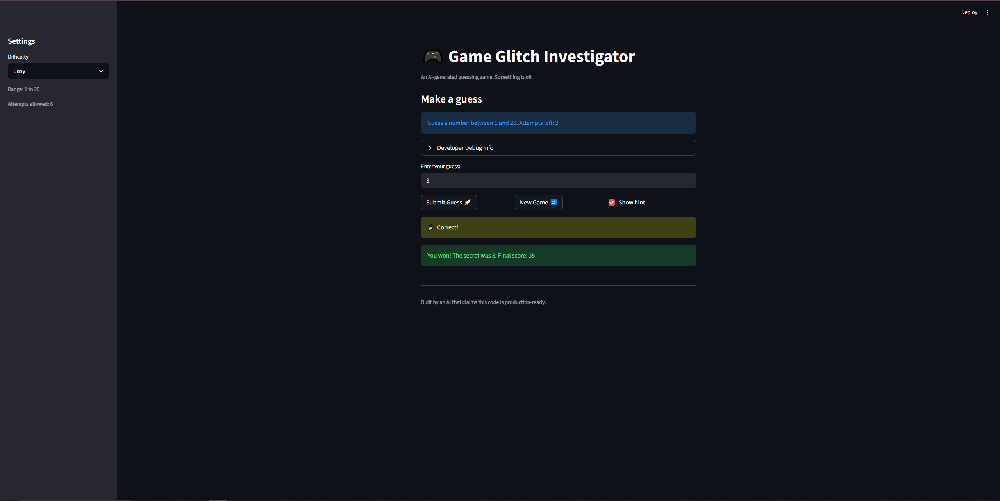

# 🎮 Game Glitch Investigator: The Impossible Guesser

## 🚨 The Situation

You asked an AI to build a simple "Number Guessing Game" using Streamlit.
It wrote the code, ran away, and now the game is unplayable. 

- You can't win.
- The hints lie to you.
- The secret number seems to have commitment issues.

## 🛠️ Setup

1. Install dependencies: `pip install -r requirements.txt`
2. Run the broken app: `python -m streamlit run app.py`

## 🕵️‍♂️ Your Mission

1. **Play the game.** Open the "Developer Debug Info" tab in the app to see the secret number. Try to win.
2. **Find the State Bug.** Why does the secret number change every time you click "Submit"? Ask ChatGPT: *"How do I keep a variable from resetting in Streamlit when I click a button?"*
3. **Fix the Logic.** The hints ("Higher/Lower") are wrong. Fix them.
4. **Refactor & Test.** - Move the logic into `logic_utils.py`.
   - Run `pytest` in your terminal.
   - Keep fixing until all tests pass!

## 📝 Document Your Experience

- [x] **Describe the game's purpose:** It's a number guessing game where the player tries to find a randomly generated secret number within a limited amount of attempts, using "higher" or "lower" hints.
- [x] **Detail which bugs you found:** 
  1. The hints were backwards (guessing too high told you to go higher).
  2. The game converted the secret number to a string on even attempts, causing a `TypeError`.
  3. The "New Game" button didn't reset the `status` state, making it impossible to replay after winning or losing.
  4. Wrong guesses on even attempts incorrectly rewarded the player with +5 points.
  5. Attempts display and control are inconsistent 
- [x] **Explain what fixes you applied:** I refactored the core game logic out of the UI and into `logic_utils.py`. I fixed the comparison operators for the hints, removed the weird string conversion and even/odd scoring glitches, and updated the "New Game" button to properly reset `st.session_state.status = "playing"` and reflect the difficulty range limits.

## 📸 Demo

- [x] [Insert a screenshot of your fixed, winning game here]

## 🚀 Stretch Features

- [ ] [If you choose to complete Challenge 4, insert a screenshot of your Enhanced Game UI here]
